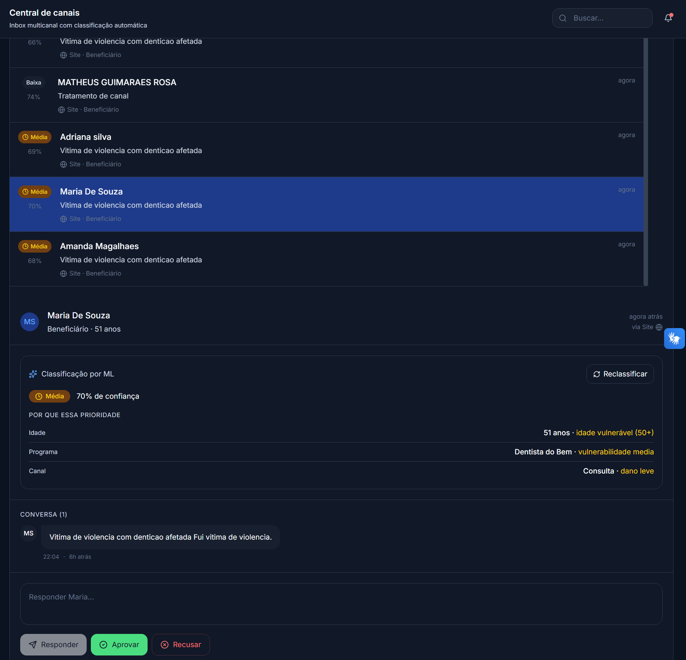
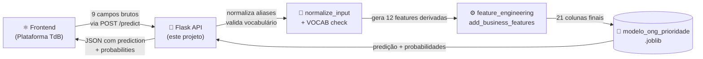

<div align="center">

# 🤖 ML_TdB — Classificador de Prioridade de Atendimentos

**API REST de Machine Learning para a ONG [Turma do Bem](https://www.turmadobem.org.br/)** — classifica solicitações de atendimento odontológico em três níveis de prioridade (**ALTA**, **MÉDIA**, **BAIXA**) usando um modelo treinado em dados reais e regras de domínio dos dois programas da ONG.

[](https://www.python.org/)
[](https://flask.palletsprojects.com/)
[](https://scikit-learn.org/)
[](https://pandas.pydata.org/)
[](https://ml-tdb.onrender.com/health)
[](LICENSE)

### 🔗 API ao vivo

[**🩺 Health check**](https://ml-tdb.onrender.com/health) &nbsp;•&nbsp; [**📋 Schema**](https://ml-tdb.onrender.com/schema) &nbsp;•&nbsp; [**🌐 Plataforma TdB**](https://www.startupados.com.br/)

</div>

---

## 📑 Sumário

- [Sobre o Projeto](#-sobre-o-projeto)
- [O Problema](#-o-problema)
- [Arquitetura](#-arquitetura)
- [Pontos Altos do Projeto](#-pontos-altos-do-projeto)
- [O Modelo](#-o-modelo)
- [Regras de Domínio](#-regras-de-domínio)
- [Stack Tecnológica](#-stack-tecnológica)
- [API — Endpoints](#-api--endpoints)
- [Estrutura de Arquivos](#-estrutura-de-arquivos)
- [Como Rodar Localmente](#-como-rodar-localmente)
- [Deploy](#-deploy)
- [Roadmap](#-roadmap)
- [Autor](#-autor)
- [Licença](#-licença)

---

---

## 📸 Integração em Produção

A API está integrada à plataforma da Turma do Bem, classificando solicitações em tempo real assim que chegam pelo formulário público. A interface mostra a classificação, a confiança do modelo e os fatores principais que levaram à decisão — permitindo ao operador entender e, se necessário, reclassificar.

<div align="center">



</div>

**O que essa tela demonstra:**

- 🎯 **Classificação automática** com nível de confiança visível (ex.: 70%)
- 🧠 **Explicabilidade da decisão** — os fatores que pesaram (idade, programa, canal, dano)
- 🔄 **Reclassificação manual** disponível quando o operador discorda do modelo
- ✅ **Fluxo de aprovação humana** preservado (Aprovar / Recusar / Responder)
- 📊 **Inbox priorizado** — solicitações ALTA aparecem com destaque visual

> Esse fluxo materializa um princípio central do projeto: **ML como assistente, não como decisor final**. O modelo sugere e justifica; o humano valida e aplica.

---

## 🎯 Sobre o Projeto

**ML_TdB** é uma API REST que serve um modelo de classificação treinado para priorizar automaticamente solicitações de atendimento da ONG **Turma do Bem**, que oferece tratamento odontológico gratuito para dois públicos em vulnerabilidade:

- **Dentista do Bem** — jovens de 11 a 17 anos em vulnerabilidade social
- **Apolônias do Bem** — mulheres vítimas de violência com dentição afetada

O modelo recebe **9 campos brutos** do solicitante (idade, sexo, programa, tipo de dano, vulnerabilidade, etc.) e retorna a prioridade classificada — ajudando a ONG a alocar recursos onde o impacto é maior.

> Esse projeto integra a plataforma maior **[Turma do Bem (StartUpados)](https://github.com/Start-Upados/Front_TdB)**, atendendo às solicitações recebidas pelo formulário público em [startupados.com.br](https://www.startupados.com.br/).

---

## 💡 O Problema

Quando solicitações chegam por canais digitais, a ONG enfrenta um desafio operacional: **como decidir, entre centenas de casos por mês, quais precisam de atendimento imediato?**

A priorização manual é:
- 🐢 **Lenta** — exige análise caso a caso
- 📉 **Inconsistente** — sujeita a viés e fadiga do avaliador
- 🚨 **Arriscada** — casos críticos podem ficar enfileirados por descuido

A solução automatiza essa decisão usando dados históricos da ONG e codifica as regras de negócio que profissionais experientes da área aplicariam.

---

## 🏛 Arquitetura



**Fluxo de uma requisição:**

1. Cliente envia 9 campos brutos via `POST /predict`
2. Aliases são normalizados (`F` → `feminino`, `urgente` → `emergencia`)
3. Campos validados contra vocabulário fechado e tipos esperados
4. Feature engineering **server-side** gera 12 features derivadas
5. Modelo (joblib) prediz a classe + probabilidades
6. Resposta JSON com `prediction` e `probabilities`

---

## ⭐ Pontos Altos do Projeto

### 🧠 Feature Engineering Server-Side
O cliente envia apenas **9 campos brutos**. O servidor calcula **12 features derivadas** (scores ordinais, flags de idade, conjunções de regras de domínio). Resultado: o frontend não precisa duplicar a lógica de negócio — é o padrão correto de API ML profissional, com a complexidade do modelo isolada do consumidor.

### 📦 Pipeline Portável (joblib + módulo separado)
O `feature_engineering.py` foi deliberadamente isolado em módulo próprio, **não inline no notebook**. Isso resolve um problema clássico: modelos serializados com `joblib` quebram quando as funções customizadas não estão importáveis no servidor. A estrutura atual garante que o `.joblib` carrega corretamente em qualquer ambiente que tenha esse módulo no path.

### ✅ Validação em Camadas
Entrada do usuário passa por três validações sequenciais com erros HTTP semanticamente corretos:

1. **Aliases** — `F`, `urgente`, `apolonias_do_bem` são normalizados antes da validação
2. **Vocabulário** — só valores do `VOCAB` passam (rejeita typos e valores fora do dicionário)
3. **Tipos numéricos** — `idade` e `tempo_espera` validados como inteiros

Erros voltam estruturados em JSON com `received`, `allowed` e código HTTP apropriado (400 para input, 503 para modelo, 500 para imprevistos).

### 📜 JSON-Only Error Handling
Handlers globais (`@app.errorhandler`) garantem que **toda resposta da API é JSON** — mesmo 404, 405 e 500. Nunca um HTML inesperado quebra a integração com o frontend. Detalhe pequeno que separa API amadora de API séria.

### 📊 Probabilidades Opcionais
Se o modelo suporta `predict_proba`, a API devolve as probabilidades de cada classe junto com a predição. Útil para o frontend exibir confiança ou implementar limiares customizados (ex.: "se ALTA < 70%, marcar para revisão humana").

### 🛡 Conversão NumPy → Python Nativo
A função `_to_native` blinda a serialização contra tipos `numpy.int64`, `numpy.float64`, etc., que o `jsonify` do Flask não consegue serializar nativamente. Sem isso, a API quebra silenciosamente em endpoints como `/health`.

### 🔒 CORS Restrito por Allowlist
As origens permitidas são controladas pela variável de ambiente `CORS_ALLOWED_ORIGINS` — apenas o frontend oficial do TdB consegue consumir a API em produção. Default seguro permite só `localhost` em dev. Evita uso indevido da API por terceiros e demonstra postura de segurança proativa.

---

## 🧪 O Modelo

### Dataset
- **Registros:** 2.638 amostras (após remoção de 9 duplicatas)
- **Origem:** dados históricos da ONG Turma do Bem, anonimizados
- **Distribuição de classes:**

| Prioridade | Quantidade | Percentual |
|---|---|---|
| BAIXA | 1.151 | 44% |
| MÉDIA | 937 | 35% |
| ALTA | 550 | 21% |

### Features

**9 campos brutos (entrada):**

| Campo | Tipo | Valores válidos |
|---|---|---|
| `programa` | categórico | `apolonas_do_bem`, `dentista_do_bem` |
| `tempo_espera` | inteiro | dias desde a solicitação |
| `sexo` | categórico | `feminino`, `masculino` |
| `idade` | inteiro | anos |
| `tipo_violencia` | categórico | `nenhuma`, `leve`, `grave` |
| `vulnerabilidade` | categórico | `baixa`, `media`, `alta` |
| `dano_dentario` | categórico | `nenhum`, `leve`, `moderado`, `grave` |
| `tipo_pedido` | categórico | `consulta`, `emergencia` |
| `tipo_tratamento` | categórico | `canal`, `extracao`, `restauracao`, `limpeza` |

**12 features derivadas (geradas server-side):**
- **Scores ordinais:** `dano_score`, `violencia_score`, `vulnerabilidade_score`, `risco_total`
- **Flags de idade:** `idade_50_mais`, `idade_jovem_alvo`
- **Conjunções de ALTA (Apolônias):** 3 features de combinações críticas
- **Conjunções de ALTA (Dentista do Bem):** 2 features de combinações críticas
- **Agregado:** `regra_alta_acionada` (soma das conjunções acionadas)

### Algoritmo
Modelo baseado em **árvores de decisão** (scikit-learn 1.6.1) treinado com `class_weight='balanced'` para compensar o desbalanceamento entre classes (BAIXA é 2x mais frequente que ALTA).

---

## 🚨 Regras de Domínio

O modelo foi treinado considerando regras de negócio críticas codificadas como features. Essas regras refletem o conhecimento clínico e social acumulado pela ONG:

### Apolônias do Bem (mulheres)
- 🔴 **ALTA** → dano grave + violência grave
- 🔴 **ALTA** → dano grave + idade ≥ 50
- 🔴 **ALTA** → dano moderado + violência grave + idade ≥ 45

### Dentista do Bem (jovens 11–17)
- 🔴 **ALTA** → vulnerabilidade alta + tratamento de canal ou extração
- 🔴 **ALTA** → vulnerabilidade alta + restauração + tempo de espera > 20 dias

Essas regras viram **features binárias** no pipeline, dando ao modelo "atalhos" treinados em vez de depender só de combinações descobertas pelas árvores.

---

## 🛠 Stack Tecnológica

| Camada | Tecnologia |
|---|---|
| **Linguagem** | Python 3.11+ |
| **Framework Web** | Flask + Flask-CORS |
| **ML / Pipeline** | scikit-learn 1.6.1 |
| **Processamento** | pandas + numpy |
| **Serialização** | joblib |
| **Servidor de Produção** | Gunicorn |
| **Hospedagem** | Render.com |

---

## 🔌 API — Endpoints

### `GET /health`
Verifica se o serviço está no ar e o modelo carregado.

**Resposta:**
```json
{
  "status": "ok",
  "model_loaded": true,
  "classes": [0, 1, 2]
}
```

### `GET /schema`
Documenta o contrato da API — útil para frontend e debug.

**Resposta:**
```json
{
  "required_fields": ["programa", "tempo_espera", "sexo", "idade", ...],
  "vocabulary": { "programa": ["apolonas_do_bem", "dentista_do_bem"], ... },
  "aliases_accepted": { "sexo": {"F": "feminino", "M": "masculino"}, ... },
  "example_request": { ... }
}
```

### `POST /predict`
Classifica uma solicitação.

**Request:**
```json
{
  "programa": "apolonas_do_bem",
  "tempo_espera": 30,
  "sexo": "feminino",
  "idade": 70,
  "tipo_violencia": "grave",
  "vulnerabilidade": "alta",
  "dano_dentario": "grave",
  "tipo_pedido": "emergencia",
  "tipo_tratamento": "canal"
}
```

**Response (200):**
```json
{
  "prediction": "ALTA",
  "probabilities": {
    "ALTA": 0.8745,
    "BAIXA": 0.0312,
    "MEDIA": 0.0943
  }
}
```

**Response (400) — entrada inválida:**
```json
{
  "error": "Valores inválidos",
  "invalid": {
    "tipo_violencia": {
      "received": "extrema",
      "allowed": ["nenhuma", "leve", "grave"]
    }
  }
}
```

### Exemplo com `curl`

```bash
curl -X POST https://ml-tdb.onrender.com/predict \
  -H "Content-Type: application/json" \
  -d '{
    "programa": "apolonas_do_bem",
    "tempo_espera": 30,
    "sexo": "feminino",
    "idade": 70,
    "tipo_violencia": "grave",
    "vulnerabilidade": "alta",
    "dano_dentario": "grave",
    "tipo_pedido": "emergencia",
    "tipo_tratamento": "canal"
  }'
```

**Teste rápido em produção:**

```bash
curl https://ml-tdb.onrender.com/health
curl https://ml-tdb.onrender.com/schema
```

---

## 📂 Estrutura de Arquivos

```
ML_TdB/
├── app.py                          # API Flask (endpoints + handlers)
├── feature_engineering.py          # Vocab + aliases + features derivadas
├── modelo_ong_prioridade.joblib    # Modelo treinado serializado
├── requirements.txt                # Dependências
├── .gitignore                      # Proteção contra artefatos locais
├── LICENSE                         # MIT
└── README.md                       # Este arquivo
```

---

## ▶️ Como Rodar Localmente

**Pré-requisitos:** Python 3.11+.

```bash
# 1. Clonar o repositório
git clone https://github.com/<seu-usuario>/ML_TdB.git
cd ML_TdB

# 2. Criar e ativar ambiente virtual
python -m venv .venv
.\.venv\Scripts\activate          # Windows
# source .venv/bin/activate        # Linux/Mac

# 3. Instalar dependências
pip install -r requirements.txt

# 4. Rodar localmente
python app.py
```

A API ficará disponível em `http://localhost:5000`.

Teste rapidamente:

```bash
curl http://localhost:5000/health
curl http://localhost:5000/schema
```

---

## 🚀 Deploy

A API está deployada no **Render** e consumida em produção pela plataforma da ONG Turma do Bem.

### Comando de inicialização (Gunicorn)

```bash
gunicorn app:app
```

> ⚠️ **Cold start:** no plano gratuito do Render, o serviço hiberna após 15 min de inatividade. A primeira requisição pode levar até ~60s para "acordar" o serviço. A plataforma do TdB lida com isso fazendo um _ping_ ao `/health` no carregamento das telas que dependem da predição.

### Variáveis de ambiente opcionais

| Variável | Default | Descrição |
|---|---|---|
| `PORT` | `5000` | Porta em que o servidor escuta |
| `MODEL_PATH` | `./modelo_ong_prioridade.joblib` | Caminho do modelo serializado |
| `CORS_ALLOWED_ORIGINS` | `http://localhost:5173,http://localhost:3000` | Lista de origens permitidas (separadas por vírgula) |

> 🔒 **Em produção, sempre configure `CORS_ALLOWED_ORIGINS`** com as URLs reais do frontend. O default só libera localhost para desenvolvimento — em produção, sem essa variável, a API rejeitará requisições do site oficial.

---

## 🔜 Roadmap

- [x] API REST com 3 endpoints (`/health`, `/schema`, `/predict`)
- [x] Feature engineering server-side
- [x] Validação em camadas (aliases → vocab → tipos)
- [x] Probabilidades opcionais por classe
- [x] Deploy em produção no Render
- [x] Integração com a plataforma Turma do Bem
- [x] **CORS restrito** a origens conhecidas via variável de ambiente
- [ ] Endpoint `/explain` retornando _feature importance_ por predição
- [ ] Métricas de uso (Prometheus / observabilidade)
- [ ] Versionamento do modelo via `/predict?v=1.2`
- [ ] Pipeline de retraining automatizado

---

## 👤 Autor

Desenvolvido por **Pedro Henrique Falchi** como parte da plataforma **Turma do Bem (StartUpados)** — FIAP 2026.

[](https://github.com/pedrofalchi-fullstack)
[](https://www.linkedin.com/in/pedro-henrique-falchi-4ab4b937b)

---

## 📄 Licença

Este projeto está licenciado sob a **Licença MIT** — consulte o arquivo [`LICENSE`](LICENSE) para mais detalhes.

---

<div align="center">

_Machine learning a serviço de quem precisa._ 🦷❤️

</div>
